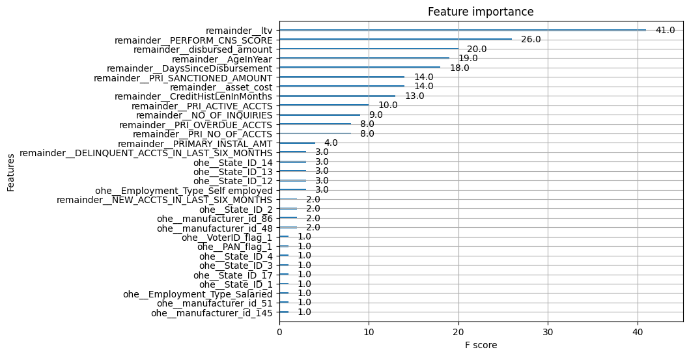
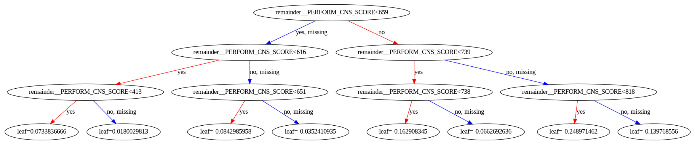
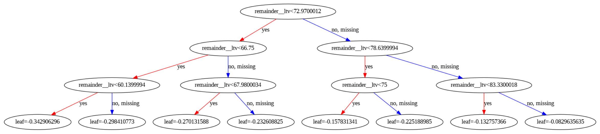

# Credit Risk Modeling

Utilizing XGBoost to predict credit risk (default probability) for loans, leveraging XGBoost `interation_constraints` to improve explanability of the trees, and explore scorecard value for each independent variable based on its feature importance plot and tree plot. 

## Model Result

### Feature Importance

### Tree Plot

Credit Score - Node Split

LTV - Node Split

---

Dataset source: [Kaggle]('https://www.kaggle.com/datasets/sneharshinde/ltfs-av-data?select=train.csv')

Notebook is inspired by GTC 2021 Building Credit Risk Scorecards [Demo]('https://github.com/rapidsai-community/showcase/tree/main/event_notebooks/GTC_2021/credit_scorecard/cpu')